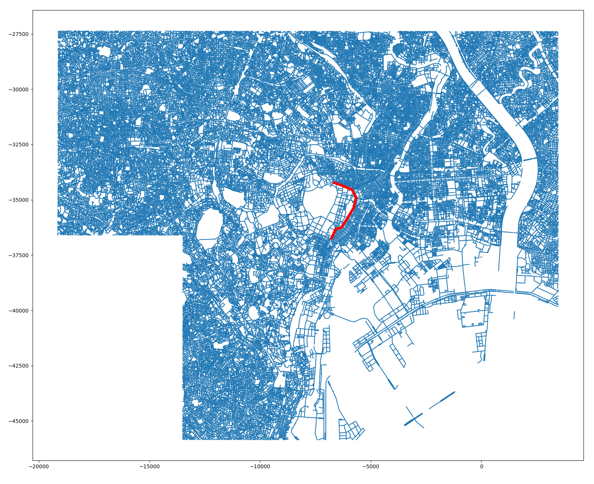
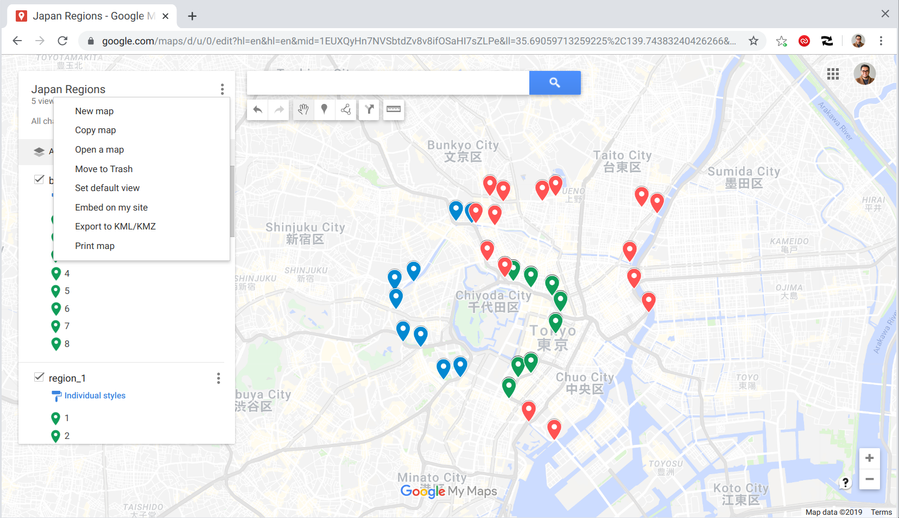
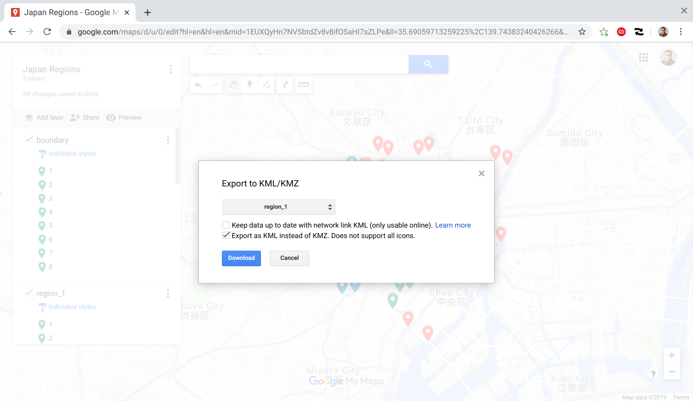
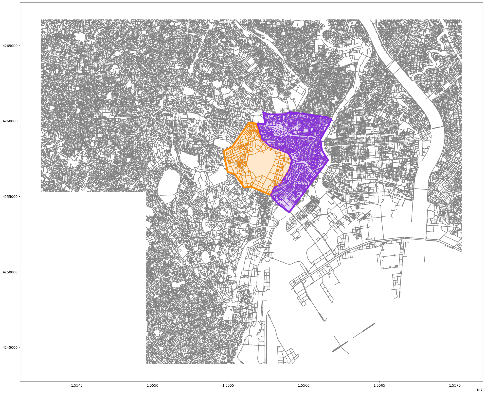
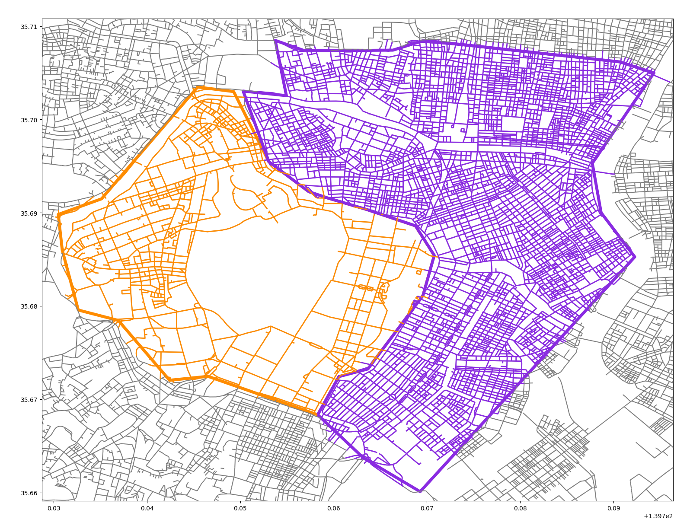
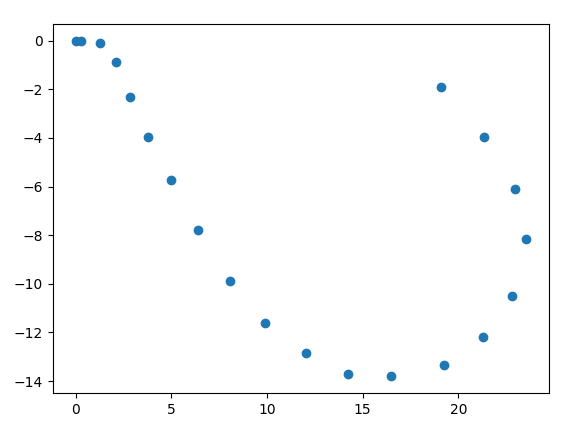
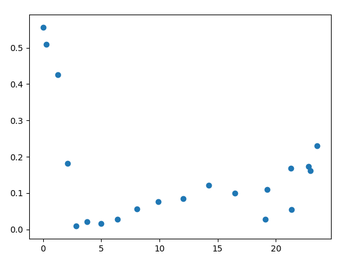

# Street Analysis Tool

- For: Dr. Kensuke Teshima and Dr. Junichi Yamasaki
- By: Omar Trejo

## Introduction

The purpose of this tool is to provide an easy-to-use command-line interface
(CLI) written in Python that can be used to calculate information useful for
research, such as street curvatures, color profiles, and inferred materials, for
specific regions (stored as Shapefile polygons), among other tasks. None of the
analysis on this repository dependon the ArcGIS software packages, and they are
all implemented used open-source tools.

## Objectives

The high-level objectives set for this code listed below.

- [x] Command-line utility
- [x] Load data
    - [x] Load street lines from Shapefiles
    - [x] Load polygon regions from Shapefiles
- [x] Generate regions from Google Maps
    - [x] Define each region as part of a Shapefile
    - [x] Read each Google Map layer as a separate region
- [x] Street curvatures
    - [x] Random sampling for speed
    - [x] Intersect with regions
    - [x] Methods
        - [x] Range
        - [x] Variance
        - [x] Direction changes
    - [x] Aggregations
        - [x] Minimum
        - [x] Mean
        - [x] Median
        - [x] Maximium
        - [x] Variance
- [ ] Building image analysis
    - [ ] Random sampling within polygons or selection
        - [ ] Let user specify images directory
        - [ ] Ensure at least X meters between points
        - [ ] Read pre-computed random sample from CSV
        - [ ] Detect previously downloaded images
            - [ ] Avoid deleting previous outputs (save costs)
    - [ ] Confirm cost estimate before execution
    - [ ] Building top images (i.e. roofs)
    - [ ] Building side images (i.e. street)
    - [ ] Infer materials from Google Vision
    - [ ] Color profiles per region

## Setup Python Environment

To be able to use the code in this repository the user needs the a Python 3.7+
installation with `pip` available to install Python packages. The steps to setup
the environment are:

1. Update `pip`: `$ pip install --upgrade pip`
    - This may need `sudo` or admin privileges
2. Install dependencies: `$ pip install -r requirements.txt`
    - You may enable a [Python Virtual
      Environment](https://docs.python.org/3/tutorial/venv.html) if
      desired
    - Assumes you're located in the root of this repository
3. Put the street and boundary Shapefiles in the appropriate directories
    - Boundary: [`./inputs/boundary/`](./inputs/boundary/)
    - Streets: [`./inputs/streets/`](./inputs/streets/)

After these steps you should be ready to run the CLI to execute analysis
described in this document.

## Command-Line Interface (CLI)

The [Click](https://click.palletsprojects.com/en/7.x/) Python library is used to
create the interface for the Python CLI. See the [`./main.py`](./main.py) for
details of such CLI implementation. This `main.py` file is the entry point for
all analysis performed by the code in this repository, and it takes care of
setting reasonable defaults for parameters not provided by the user.

To see what analysis are available the user can execute the line below. The
response will show how to execute the CLI, as well as the commands available
within (i.e. `generate-regions`, `image-profiles`, and `street-metrics`).

```
$ python main.py

Usage: main.py [OPTIONS] COMMAND [ARGS]...

Options:
  --help  Show this message and exit.

Commands:
  generate-regions
  image-profiles
  street-metrics
```

To see the available options for any of these commands, we can use the `--help`
flag, as mentioned in the previous execution output. For example, if we want to
see the options available for `street-metrics`, we would use the following:

```
$ python main.py street-metrics --help

Usage: main.py street-metrics [OPTIONS]

Options:
  -i, --input TEXT                Shapefile with street lines used to
                                  calculate curvatures.  [default:
                                  ./inputs/streets/allroads_jgd2000.shp]
  -m, --method [all|range_min|range_mean|range_median|range_max|range_var|variance_min|variance_mean|variance_median|variance_max|variance_var|direction_changes_min|direction_changes_mean|direction_changes_median|direction_changes_max|direction_changes_var|density_streets|density_points]
                                  Methods used to calculate street
                                  statitistics. `all` indicates all methods
                                  will be used. `range` uses the difference
                                  between the maximum and minimum street's
                                  curvature values. `variance` calculates the
                                  variance of the street's curvature values.
                                  `direction_changes` makes use of the order
                                  in the street's curvature values to
                                  calculate how many times a non-monotone
                                  change takes place. `density_streets`
                                  divides the number of streets in a region by
                                  the region's area in meters.
                                  `density_points` splits streets lines into
                                  individual points and calculates density as
                                  'points-per-squared-meter'.  [default: all]
  -g, --regions TEXT              Shapefile with region polygons used to
                                  filter inputs. Use `none` to avoid
                                  filtering.  [default:
                                  ./inputs/regions/shapefiles/regions.shp]
  -r, --region-variable TEXT      Region variable name used to filter input
                                  regions. Only used if a --region-selection
                                  is also provided (otherwise ignored).
                                  [default: region]
  -s, --region-selection TEXT     Either `none` to intersect with all regions
                                  in the --regions file, or for multiple
                                  region selection use `-s <region_1> -s
                                  <region_2> ...`. Filters on --region-
                                  variable. Only used if --regions is provided
                                  (otherwise ignored).  [default: none]
  -o, --output-dir TEXT           Directory to store outputs. `none` avoids
                                  storing any outputs. If previous outputs
                                  exist matching this --output-dir they will
                                  be deleted beforehand.  [default:
                                  ./outputs/curvatures/]
  -n, --random-sample-size INTEGER
                                  If positive, use as random street sample
                                  size (used to speed up results when
                                  developing but for actual analysis full data
                                  is probably desired). If negative, this
                                  value is ignore (i.e. no sampling).
                                  [default: -1]
  --help                          Show this message and exit.

```

As can be seen there are various options (the explanation for each of these
options is in the `Street Curvatures` section). Note that the information
printed also shows what will be used as the `default` value in case the user
does not override it. The same `--help` flag applies to all other commands.

Finally, note that not providing the `--help` flag will actually trigger the
execution of the command, using all the defaults that were not overriden.

```
$ python main.py street-metrics   # Executes command with defaults parameters
```

## Generate Regions from Google Maps

### Initial impressions of the street and boundary data

The original street data and boundary shared by Dr. Teshima and Dr. Yamasaki are
shown in the image below (not sure why there's a missing square on the bottom
left, but that is part of the street data itself).



A couple of things can be noted straight away from the data and the image:

- The quality of the street data is high with detailed representation
- There is one set of lines for each different street, which is great
- The boundary information is incomplete and needs to be extended

The locations for these Shapefiles are:

- Streets: [`./inputs/streets/`](./inputs/streets/)
- Bounadry: [`./inputs/boundary/`](./inputs/boundary)

When the Shapefiles for the street data are loaded using `geopandas`, the data
shows each street as a group of points that are joined by straight lines. This
is a very good reprsentation because it will allow for granular control during
the analysis.

What needs to be fixed is the boundary because it doesn't represent two
different regions (i.e. polygons) that can be used to specify areas for the
analysis. The process to achieve this is described in the following subsection.

### How to fix the boundary regions using Google Maps

To easily define the regions necessary for the analysis we use the "layers"
feature of Google Maps. As can be seen in the image below, there are three
layers: green for the original boundary, blue for the extension of the boundary
that goes towards the left, and red for the extension of the boundary that goes
towards the right. The points used come from a previou discussion between Omar
and Dr. Teshima. **If these areas are not the correct ones, please let Omar know
which are the correct areas so that he can fix them**. The points shown in the
image form polygons that will be used to define the regions used in the
analysis.



Next, we need to download each of the Google Maps layers as a separate KML file.
A KMZ file must not be used because the Python libraries used do not support
loading KMZ files. When these KML files are downloaded, they must use as a
filename the name of the region that will be used to refer to that particular
area during the rest of the analysis. Since Omar does not have information for
what these regions should be called as of now, the generic names `region_1` and
`region_2` are used for the left and right regions, respectively. These files
are downloaded to the
[`./inputs/regions/google_maps/`](./inputs/regions/google_maps/) directory. The
image below shows the downoad dialog box shown by Google Maps with the options
that should be selected for each layer.



> **NOTE**: [This is the Google Map created by
> Omar](https://www.google.com/maps/d/u/0/edit?hl=en&hl=en&mid=1EUXQyHn7NVSbtdZv8v8ifOSaHI7sZLPe&ll=35.69038991893907%2C139.74383240426266&z=13)
> and shown in the images

Once these inputs are in place, the CLI `generate-regions` command can be used
to create the [`./inputs/regions/shapefiles/`](./inputs/regions/shapefiles/)
Shapefiles that will be used in the rest of the analysis. Before we execute the
actual command, we can look at its help information with:

```
$ python main.py generate-regions --help

Usage: main.py generate-regions [OPTIONS]

Options:
  -i, --inputs TEXT  Directory with KML files downloaded from Google Maps with
                     the points that will be converted to polygon regions.
                     Each layer in the Google Maps map should be downloaded
                     separately, and the corresponding file name for each of
                     these KML files will be taken as the region name for each
                     polygon.  [default: ./inputs/regions/google_maps/]
  -o, --output TEXT  File to save polygon regions shapefile to. Various
                     metadata files are created around the Shapefile (e.g.
                     regions.dbf, regions.prj, etc). If previous files exist
                     they will be deleted beforehand.  [default:
                     ./inputs/regions/shapefiles/regions.shp]
  --help             Show this message and exit.
```

As can be seed in the information above, the `--inputs` default value is the
directory we have already created and put the KML files in. The `--output`
directory will be created automatically for us, and the default value should be
fine (previous outputs stored in the `--output` location will be deleted if they
exist).

We execute by running:

```
$ python main.py generate-regions  # No explicit params ==> use the defaults

********************************************************************************
                                GENERATE REGIONS
********************************************************************************
--------------------------------------------------------------------------------
Parameters
--------------------------------------------------------------------------------
{'inputs': './inputs/regions/google_maps/',
 'output': './inputs/regions/shapefiles/regions.shp'}
--------------------------------------------------------------------------------
Info
--------------------------------------------------------------------------------
{'init': 'EPSG:4326'}
<class 'geopandas.geodataframe.GeoDataFrame'>
RangeIndex: 2 entries, 0 to 1
Data columns (total 2 columns):
region      2 non-null object
geometry    2 non-null geometry
dtypes: geometry(1), object(1)
memory usage: 160.0+ bytes
None
--------------------------------------------------------------------------------
Preview
--------------------------------------------------------------------------------
     region                                           geometry
0  region_1  POLYGON ((139.75827 35.66836, 139.76055 35.672...
1  region_2  POLYGON ((139.75827 35.66836, 139.76055 35.672...

```

As you can see in the output, the default parameters are fine, and the region
Shapefiles are successfully created. After executing the above, they should
appear in the [`./inputs/regions/shapefiles/`](./inputs/regions/shapefiles/)
directory. You should be able to load these Shapefiles into other geographical
analysis software, and they contain two polygons for `region_1` and `region_2`.
After this point the KML files are no longer necessary and can be deleted.

> **NOTE**: If the analysis is desired for more regions, it's just a matter of
> creating more Google Maps layers, downloading their KMLs files into the
> corresponding directory, and re-executing the script. This will create the
> corresponding regions in the region Shapefiles, which can be used for the rest
> of the analysis described in this document.

Here's a zoomed-out version of the two regions (`region_1` is orange/left, and
`region_2` is purple/right):



Here's a zoomed-in version of the two regions (`region_1` is orange/left, and
`region_2` is purple/right):



## Street Curvatures

- Convert into EPSG:3857 because units are in meters for area calcuations
- Street points must be ordered for this curvature technique
     - They are already ordered

### The main problem

The main problem being solved is: measure the "curvature" of the streets in each
"region", where "regions" are represented by the orange and purple areas in the
images from the previous section. The main idea is that two different regions
that evolved differently will likely exhibit different characteristics in its
streets, and a way of measuring those differences is through the streets'
"curvature". Note that the "curvature" concept here is an abstract, yet
to-be-defined concept, that we will materialize in upcoming subsections in this
document.

### The main data assumption

Some obstacles and approaches around these abstract "curvature" concept are
angles between street intersections, L-shaped streets (where the street, either
as independent or continuation streets, are perpendicular), and how to
distinguish when streets are continuations streets or single long streets.
Fortuantely, by the good-quality street data provided by Dr. Teshima an Dr.
Yamasaki, we can avoid these problems using the assumption that each row in the
street data, which in turn contains a collection of points joined by straight
lines to form the shape of a street, represents a single street, which is
independent of others in the data set. Under that assumption, we can distinguish
perfectly between two continuation streets or a single long one, and we can also
work with L-shaped streets as single entities. Futhermore, the angle of
intersection between streets is no longer problematic when calculating a
street's "curvature" because we can treat different streets independently.

### Defining "curvature"

The curvature concept used to calculate the street metrics is based on
[parametric curves](https://en.wikipedia.org/wiki/Parametric_equation). These
curves remove the restrictions of normal functions that do not allow two
different y-values for a single x-value in a 2D space, where x and y refer to
the horizontal and vertical axes, respectively. A parametric curve allows for
these types of curves, which are necessary to reprsent streets in a 2D space
where the street may zig-zag and move in ways that can't be represented by
normal functions.

These parametric curves have a well-defined curvature concept where the
curvature ($k$) is defined to be:

$$k = \frac{\left| x' y'' - y' x''\right|}{\left( x'^2 + y'^2 \right)^{3/2}}$$

where $x(t)$ and $y(t)$ are parametric curves as functions of $t$ (which can be
thought of time if we're thinking about moving objects), $x' = dx(t)/dt$ and
$y' = dy(t)/dt$ are the first derivaties of $x$ and $y$ with respect to $t$, and
$x'' = d^2x(t)/dt^2$ and $y'' = d^2y(t)/dt^2$ are the second derivatives of $x$
and $y$ with respecto to $t$. More information can be found in the [Wikipedia
page for curvature](https://en.wikipedia.org/wiki/Curvature).

When this curvature value is close to zero it means that there's not much of a
curve around the particular point we're looking at on a line. It doesn't matter
if it's a horizintal, vertical, or diagonal, but in general it's a line without
a lot of curve around it. If we pick a point on a line that is not straight but
has a lot of curves around it, this curvature value will increase. The more
pronounced the curves around a point, the higher the curvature value.

John Cook does a nice way of explaining this curvature concept clearly in his
[Curvature and automatic differentation
post](https://www.johndcook.com/blog/2018/03/30/curvature-and-automatic-differentiation/).
In that post he uses a logistic curve instead of a general parametric curve
allowing him to simplify the curvature definition mentioned above into:

$$k(x) = \frac{y''}{\left( 1 + y'^2 \right)^{3/2}}$$

which can be achieved by setting $x(t) = t$ and $y(t) = f(t)$, where $f(t)$ is a
function (not a general parametric curve). That simplification allows him to
explain the concept clearly. However, it must be noted that he is using a
mathematical definition and automatic differentiation to compute the curvature.
In our case, we don't have a mathematical defintion for each street we're trying
to compute a curvature for. Therefore, in our case we use numerical
differentiation on the points that define the lines in a street. However, the
fundamental concepts are the same. The code that computes the curvature is
simple and can be found in [`./streets/curvature.py`](./streets/curvature.py).

### Showing "curvature" behavior with an example

To exemplify the behavior of these curvature values, we use the following
example. Imagine a street that is formed by the points in the image below. If
you join/interpolate those points with straight lines you would get an
approximation of a curvy street in a so-called U-shape. These points are exactly
the type of data we have in the street data provided by Dr. Teshima and Dr.
Yamasaki.

If you think about it, at the beginning of the curve (top-left) we have a first
small curve defined by the first two points and the subsequent two which already
start curving down, forming a tight curve. Then as we continue to move right,
around the x-axis value of 5, if you move to the before/after parts of that
segment of the line you're pretty much on the same diagonal line that goes from
top-left to bottom-down. This part of the sequence is very linear (i.e. low
curvature). Then as we approach the x-axis value of 15 and toward the end the
curvature starts increasing again, but not as aggresively as the curve formed at
the beginning of the line (top-left), meaning that the curve formed around
x-axis values of 15 to 20 is more "open" or "wider" than the curve formed in
x-axis between 0 and 3, which is relatively more aggresive or "curvier".



After we apply numerical differentiation and use the curvature formula defined
above for each point in the series we get the following curvature values. Note
that they follow the pattern described in the previous paragraph: around the
x-values between 0 and 3 we have aggresive curvature, then we see a
stabilization period with low curvature between x-axis 3 to 15, and then we see
another increase in curvature, but in a less aggressiv manner, after x-axis
value 15.



An important thing to note is for each street in the analysis we will have many
curvature values. To be precise we will have $n - 1$ curvature values where $n$
is the number of points that define the lines for each street in the data. Since
we want a single number to represent each street's curvature, not a whole
distribution of curvature values, we need to compress these curvature values for
each street, and that's the focus on the next section.

### Three simple compression methods

As we mentioned previously, each street will have many curvature values. The odd
cases will be when only two points define a whole street (i.e. perfect line
street), in which case no curvature values will be available, and its curvature
is automatically determined to be zero because it's a perfectly straight line.
In other cases, we will have multiple values whose information we need to
compress. To do that, three simple methods are shown below, but more should be
created that highlight the characteristics of the research being performed.

#### Range

The "range" is defined to be the difference between the maximum and minimum
curvature values for a each street. This difference defines a range in which all
other curvature values exist. The wider the range the wider the curvature
difference withing the same street (i.e. some parts in the street seem to be
straight and other parts seem to be very curvy).

#### Variance

This is a simple "variance" calculated using the curvature values for each
street. The larger the variance the the more varied the street's behavior is.
The difference with the "range" method above is that while that one takes only
the extremes into consideration to define a range width, this one takes all the
street's available curvature values into the calculation.

#### Direction Changes

An fact that had not been made explicit until now is that the points in the
street lines have an implicit order. That order can be used as parts of the
calculations used to compress the information. For the "direction changes"
calculation we count the number of times the curvature values break monotonicity
(either increasing or decreasing), which is associated with changes in the
street's curve direction.

### Five common aggregations

Even after we compute the curvature for each street in a region we still have
not reached the objective, which is to get a "curvature measurement" for a whole
region. In this case, common aggregations on top of the the street compressed
curvature values can be used. The values currently configured in the code are
the standard minimum, mean, median, maximum, and variance statistics, all of
which operate on top of the compressed curvature values across all streets in a
region.

### Two density related metrics

Another way that geographical information around the streets and the regions
can be used to identify differing behaviors across regions is using density
measures, which counts entities per squared area unit.

#### Street density

The street density is simply the number of streets in a region divided by the
area in squared meters for said area, i.e. "streets-per-squared-meter".

#### Point density

Similarly, the point density is simply the number of points in a region divided
by the area in squared meters for said area, i.e. "points-per-squared-meter".
These points are taken from the points that form streets, and this measure does
not necessarily represent the same as the "streets-per-squared-meter" metric
since the more curvy the streets are the more pionts they will require to be
defined, which makes the "points-per-squared-meter" a more sensitive metric to
"curvyness"

### Current results

Current results can be found in the
[`./outputs/curvatures/results.csv`](./outputs/curvatures/results.csv) CSV file.
In it it can be seen that `region_2` is about 40% larger than `region_1`.

| `region`   | `area` (m2) |
|------------|-------------|
| `region_1` | 12,336,347  |
| `region_2` | 17,287,173  |

The `range_mean` for `region_1` is about 3.4x the one for `region_2`, meaning
that in average `region_1` has wider ranges (i.e. streets which are less
homogeneous). However, at the same time the `range_max` for `region_2` is about
2.6x the one for `region_1`, meaning that even though in average `region_2` has
more stable streets it also has the most extreme ones. The variances differenes
are not as extreme between the regions when looking at `range`.

| `region`   | `range_min` | `range_mean` | `range_median` | `range_max` | `range_var` |
|------------|-------------|--------------|----------------|-------------|-------------|
| `region_1` |           0 |   0.02688876 |              0 |  3.81508743 |  0.04336928 |
| `region_2` |           0 |   0.00778760 |              0 |  9.92920340 |  0.03024448 |

The interesting variance results are for `variance_max` in which we see that
`region_2` is about 6.7x large than `region_1`, and the `variance_var` is about
6.1x larger for `region_2` than for `region_1`. This is a more extreme version
of the same behavior we had seen with `range`.

| `region`   | `variance_min` | `variance_mean` | `variance_median` | `variance_max` | `variance_var` |
|------------|----------------|-----------------|-------------------|----------------|----------------|
| `region_1` |              0 |      0.00687359 |                 0 |     2.72775304 |     0.01095721 |
| `region_2` |              0 |      0.00559308 |                 0 |     18.4841235 |     0.06771064 |

Note that `dc` stands for `direction_changes` to preserve space. In this case we
see that the average `dc_mean` and `dc_var` are around 5x to 6x larger for
`region_1` than for `region_2`, which is different information from what we had
seen with the `range` and `variance` metrics. This is due to the fact that
`direction_changes` measure changes in direction not the intensity of the
change.

Combining the results from `range`, `variance`, and `direction_changes` it can
be concluded that the streets in `region_1` are exhibit more extreme behavior
(more aggressive changes) but the streets in `region_2` change direction more
often although in a smoother way.

| `region`   | `dc_min` |  `dc_mean` | `dc_median` | `dc_max` |   `dc_var` |   |
|------------|----------|------------|-------------|----------|------------|---|
| `region_1` |        0 | 0.25350233 |           0 |        9 | 0.62286131 |   |
| `region_2` |        0 | 0.04786005 |           0 |        9 | 0.09419967 |   |

Finally, the density metrics tell us that `region_2` has about 4.3x more streets
and 3.5x more points, per squared meter. This is aligned to the conclusion
above: since there is a less than proportional pointss increase vs street
increase (3.5x vs 4.3x) per-squared-meter from `region_2` compared to
`region_1`, it means that `region_2` has more streets and more points, but needs
less points to represent the proportional number of streets, which implies that
streets are smoother or less curvy in `region_2` than in `region_1`, which may
be the case in part because the streets seem to be shorter in that area.

| `region`   | `n_streets` | `density_streets` | `n_points` | `density_points` |
|------------|-------------|-------------------|------------|------------------|
| `region_1` |        1499 |         0.0001215 |       4211 |        0.0003413 |
| `region_2` |        9089 |         0.0005257 |      21037 |        0.0012169 |

### Possible improvements

[Adam Franco's `curvature`
repository](https://github.com/adamfranco/curvature#calculating) makes use of an
idea where the curvature for a street is amplified by the street's lenght. This
idea allows for the differentiation of long-curvy roads from short-curvy roads,
which may be important depending on the research objective, and could be one
improvement.

Many other improvements are possible, as was mentioned previously, by designing
more methods of compressing the information in the curvature distribution values
in a way that is valuable for the research objectives. The three methods shown
(i.e. `range`, `variance`, and `direction_changes`) are some simple ones, but
moe sophisticated methods could be designed.

Finally, as was mentioned before, the streets are assumed to be independent and
no interaction effects are considered between them as of now. Introducing these
interaction effects between streets could also be valuable depending on the
research objectives.

## Building Image Analysis

- TODO: In Progress

## Working with the Data Files

All Shapefiles are loaded using the [`geopandas`](http://geopandas.org/) Python
library, which leverages [`pandas`](https://pandas.pydata.org/) constructs to
simplify the analysis of geographical data using well-known data wrangling
techniques. Another related library used to create graphs is
[`descartes`](https://pypi.org/project/descartes/).

The [`./inputs/boundary/discontown2.*`](./inputs/boundary/) files are in the
European Petroleum Survey Group (EPSG) `EPSG 2451` Coordinate Reference System
(CRS) which is optimized for coordinates for Japan. To be able to interface with
other software libraries we need to be able to move back and forth from the
`EPSG 4326` CRS, also known Word Geodetic System 1984 `WGS84` (the most common
CRS with longitude and latitude coordinates, and degrees as the distance unit),
and `EPSG 3857` (a system with meters as a distance unit). This last one is
necessary to compute the areas of the region polygons mentioned in the `Street
Curvatures` section.

The [`./inputs/regions/google_maps/`](./inputs/regions/google_maps/) KML files
are downloaded from the Google Maps web application as mentioned in the section
`Generate Regions from Google Maps`. These files are non-standard and require
KML drivers to be enabled for [`fiona`](https://pypi.org/project/Fiona/). As was
mentioned before, only KML files are supported (KMZ files not supported), and
only the first layer in the KML file is loaded, so instead of downloading a
single file with all the Google Map layers, each layer should be downloaded into
its own KML file, and all of these files should be stored in the same directory.
Once these KML files are transformed into regions using the code described in
the `Generate Regions from Google Maps` section, they will be loaded as
Shapefiles from that point on for the rest of the scripts.

## References

Below are links of interest for concepts/tools mentioned within this document.

- https://www.johndcook.com/blog/2018/03/30/curvature-and-automatic-differentiation/
- https://en.wikipedia.org/wiki/Parametric_equation
- https://en.wikipedia.org/wiki/Curvature
- https://epsg.io/2451
- https://epsg.io/3857
- https://epsg.io/4326
